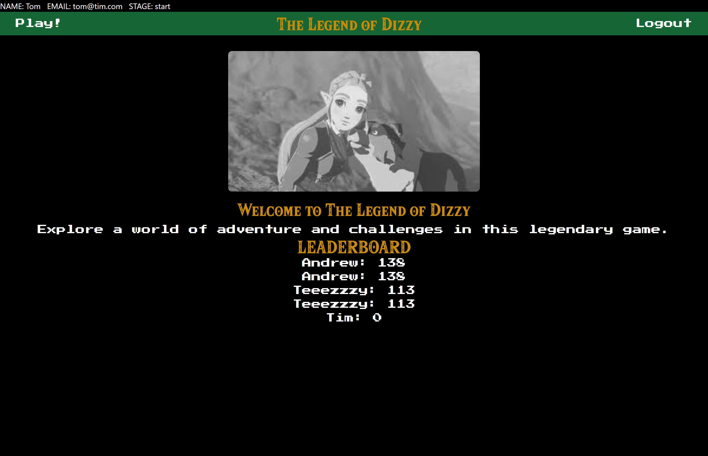
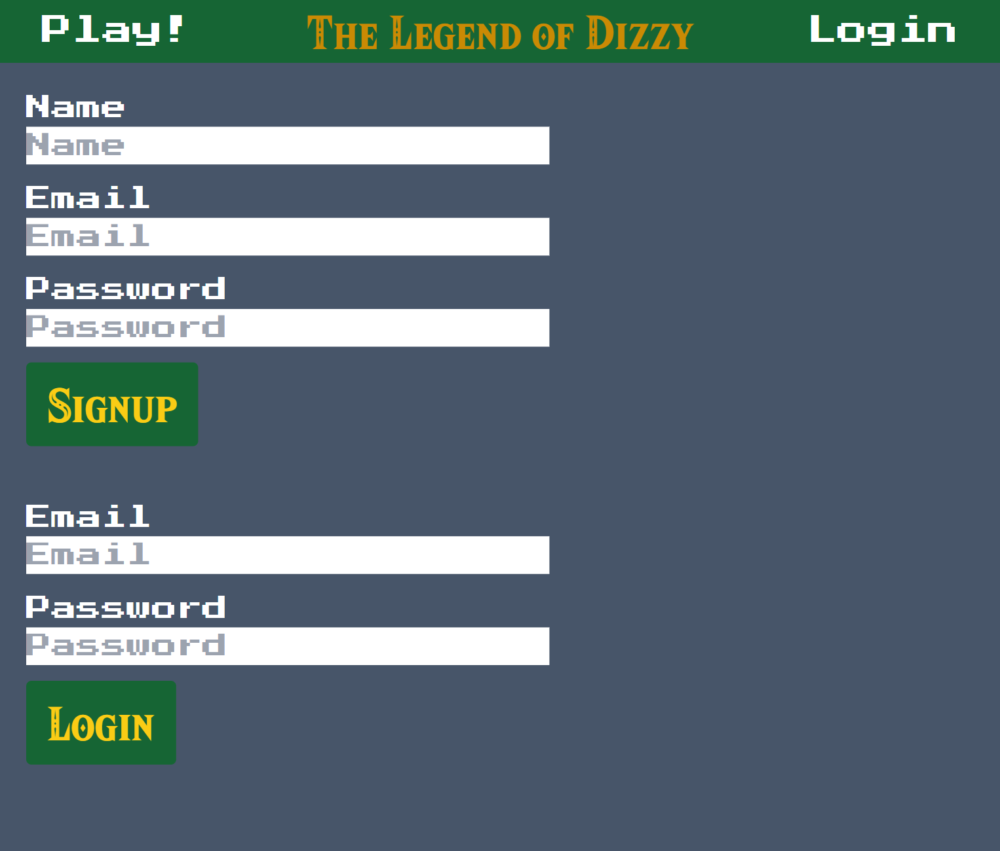
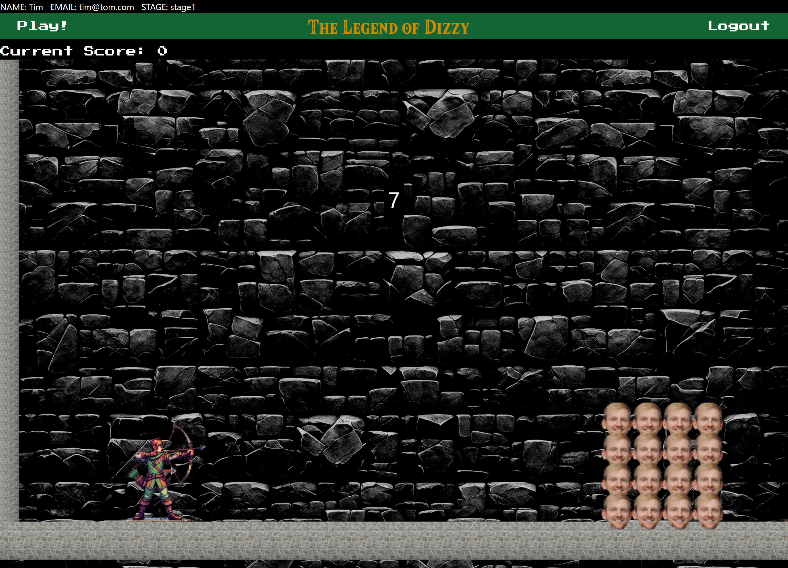
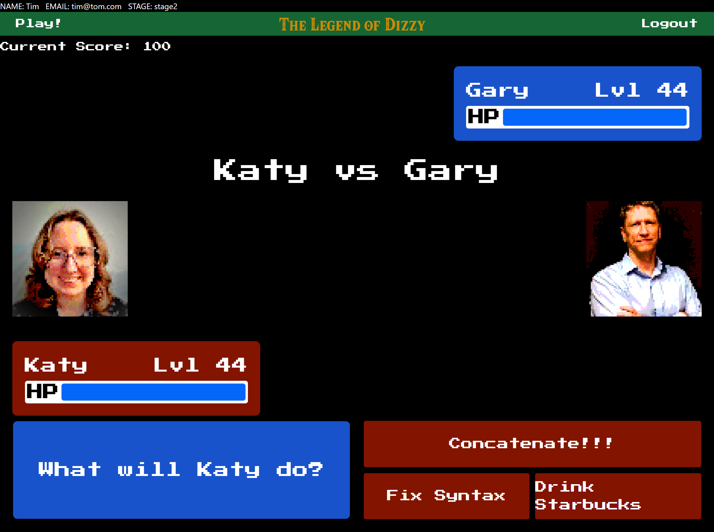
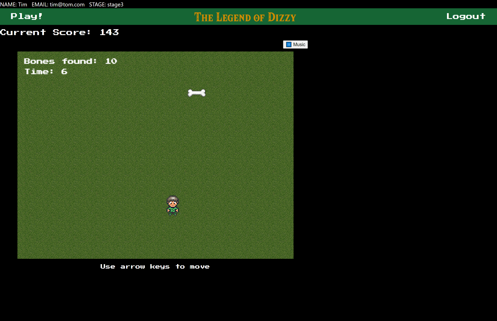
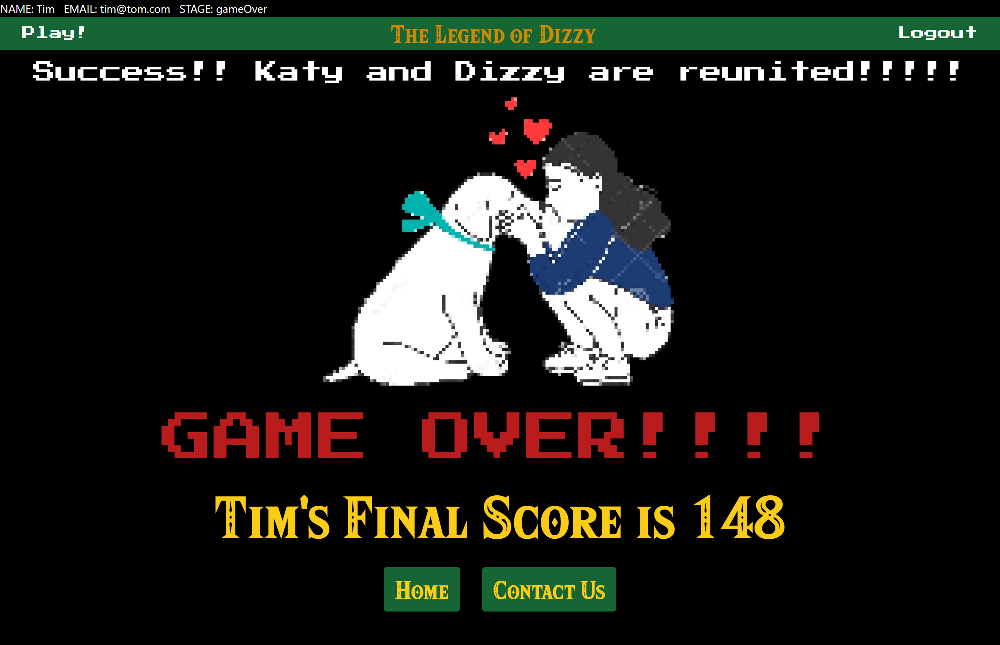
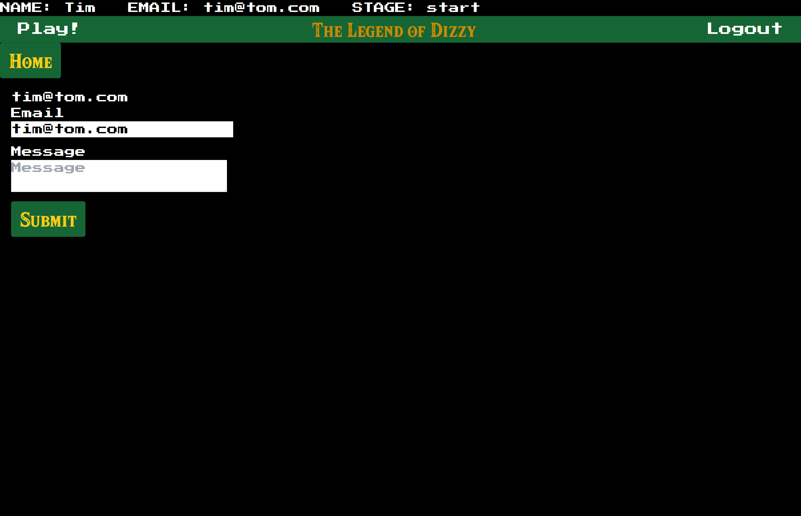

# The Legend of Dizzy 

## Table of Contents

- [Description](#description)
- [Installation](#installation)
- [Usage](#usage)
- [Credits](#credits)
- [License](#license)

## Description
The website is a collection of minigames where users compete to get the high score and experience a riveting tale.

## Installation
Open the website with browser of choice.

Deployed website URL: 

## Usage

When you open the site you will be presented with an intro page with 2 selectable options at the top of the page, Play and Login.  If the user is not logged in both options will bring them to the sign up/login page.  There will also be high scores displayed at the bottom of the page.  A list for all time high scores and, if the user is logged in, their personal high scores.
 

After signing up or logging in the user will be taken back to the main screen where the "Login" selection has been replaced with "Logout."  The "Play" button will now be able to take them to the game page.

After a short intro the user will be promped to start the first game which has the user trying to shoot a target using arrows as many times as possible within the time limit.  Clicking the left mouse button will shoot an arow.  The player character can move and jump using the arrow keys.  Obstacals in the way must be cleared in order for the target to be hit.  The obstacles can be moved by either shooting them with arrows or pushing them with the player character.  The game ends when the timer reaches 0.  A score will once again be calculated based on their performance.  After their victory the user will be taken to an end screen with a prompt to continue.

Another bit of story text will be displayed as well as a button to start the next game.  The next game is turn based battle game where the user can pick moves to try and defeat the opponent.  A score will be calculated based on their performance.  After their victory the user will be taken to an end screen with a prompt to continue.

Once more story text will be displayed and a promped will be given to continue to the final game.  The final game has the user collect bones and finally find Dizzy the dog..  The player character is controlled with the arrow keys.  Music can be paused by clicking the pause button in the upper right of the game screen.  Doing certain actions will increase or decrease score and at the end of the game the final score is calculated.  Once Dizzy is located the game will end.

A congradulations screen and the final score will be presented.  Last, there will be prompts to either return to the home page or go to the contact page.

On the contact page the will be a link to write an e-mail to the site developers.

## Credits

-Andrew, [AHelmin](https://github.com/AHelmin)

-Tyler, [tylerpeterson8791](https://github.com/tylerpeterson8791)

-Joseph, [j-preim](https://github.com/j-preim)

-Daniel, [dnoon23](https://github.com/dnoon23)

Additional code from:

Chirp Internet: www.chirpinternet.eu

PortEXE: https://www.youtube.com/watch?v=r7Z7R25spkE

Zelda Universe: https://zeldauniverse.net/media/fonts/

## License
